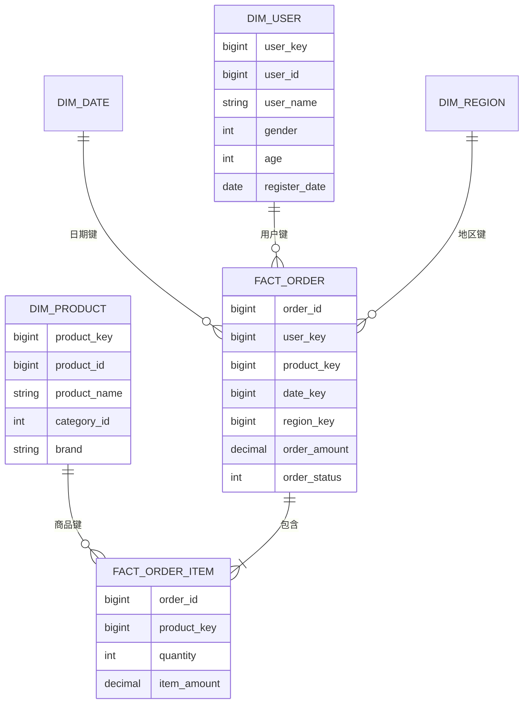
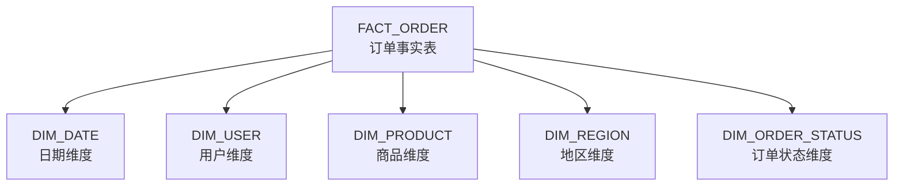

# 生成维度模型 (Dimension Model Generator)

## 触发词

`维度模型`, `概念模型`, `逻辑模型`, `CDM`, `LDM`, `主题域`, `星型模型`, `雪花模型`, `dimension model`, `star schema`, `snowflake schema`, `事实表`, `维度表`

---

## 模板绑定

---

| 精简模板 | 路径 | 说明 |
|----------|------|------|
| 07-dimension-model.md | `templates/07-dimension-model.md` | 参考/模板 |

## 输入输出映射

### 必需输入

| 字段 | 类型 | 说明 |
|------|------|------|
| `business_processes` | list | 业务过程清单（如：下单、支付、发货、退款）|

### 可选输入

| 字段 | 类型 | 说明 |
|------|------|------|
| `metrics_list` | list | 指标清单（来自 gen-metrics-dictionary）|
| `dimensions` | list | 已识别的维度（时间/地区/产品/客户等）|
| `granularity` | dict | 粒度（事实表名 -> 粒度描述）|
| `source_tables` | dict | 源表清单（来自 gen-source-data-dict）|
| `data_modeling_paradigm` | enum | 建模范式：kimball（维度建模）/ inmon（3NF）/ hybrid |
| `slowly_changing_dim` | dict | SCD 类型（维表名 -> SCD1/SCD2/SCD3）|

### 输出物

| 字段 | 类型 | 说明 |
|------|------|------|
| `cdm_diagram` | Mermaid | 概念数据模型图 |
| `ldm_diagram` | Mermaid | 逻辑数据模型图（星型/雪花）|
| `subject_areas` | Markdown | 主题域划分 |
| `entity_definitions` | Markdown | 实体定义（事实/维度）|
| `model_design_doc` | Markdown | 完整设计文档 |
| `outstanding_items` | list | 待确认项 |

---

## 自动执行步骤

1. **划分主题域** — 按业务过程或业务板块划分（如：销售/会员/商品/财务/库存）
2. **识别业务过程** — 每个主题域下识别核心业务过程
3. **声明粒度** — 每个事实表必须明确粒度（如：一行 = 一张订单 / 一个订单明细）
4. **识别维度** — 时间/地区/产品/客户/渠道 等公共维度
5. **识别度量** — 数值型度量（金额/数量/次数）
6. **设计事实表** — 事务事实表 / 周期快照事实表 / 累积快照事实表
7. **设计维度表** — 含 SCD 策略、代理键、自然键
8. **绘制 ER 图** — 概念模型（CDM）→ 逻辑模型（LDM）
9. **评审** — 与业务方核对粒度、口径、维度覆盖

---

## 4 类建模范式

| 范式 | 代表 | 适用场景 | 特点 |
|------|------|----------|------|
| **维度建模（Kimball）** | Kimball | 数据仓库/集市 | 星型/雪花，便于分析 |
| **3NF 建模（Inmon）** | Inmon | 企业级数据仓库 | 范式化，避免冗余 |
| **Data Vault** | Dan Linstedt | 敏捷数仓 | 中心+链接+卫星 |
| **Anchor 建模** | Lars Rönnbäck | 高变更场景 | 6NF 极端范式化 |

> 推荐：**核心数仓用 Inmon 3NF + 数据集市用 Kimball 维度建模**

---

## 3 类事实表

| 类型 | 特点 | 适用场景 | 粒度 |
|------|------|----------|------|
| **事务事实表** | 一行 = 一个业务事件 | 下单、支付、点击 | 事件级 |
| **周期快照事实表** | 一行 = 一个周期状态 | 库存快照、账户余额 | 周期级（日/周/月）|
| **累积快照事实表** | 一行 = 一个业务生命周期 | 订单全流程、贷款审批 | 多个时间戳字段 |

---

## 缓慢变化维（SCD）

| 类型 | 策略 | 实现方式 | 适用 |
|------|------|----------|------|
| **SCD1** | 覆盖 | `UPDATE` | 错误更正 |
| **SCD2** | 新增行（保留历史）| `INSERT` + 生效/失效时间 | 维度属性变更需保留历史 |
| **SCD3** | 新增列 | `ALTER TABLE ADD COLUMN` | 只需保留上一次值 |
| **SCD4** | 历史表 | 单独历史维表 | 频繁变更 |

---

## 输出模板示例

### Markdown 格式

```markdown
# 数据模型设计说明书 v1.0 — {项目名称}

> 建模方法：Kimball 维度建模 + Inmon 3NF 混合
> 评审状态：⚠️ 待业务方评审

---

## 1. 主题域划分

```
DWD 层（明细层）
├── dwd_sales（销售域）
│   ├── dwd_sales_order（订单明细）
│   └── dwd_sales_order_item（订单明细行）
├── dwd_user（会员域）
│   └── dwd_user_profile（会员主档）
├── dwd_product（商品域）
│   └── dwd_product_sku（SKU 主档）
└── dwd_finance（财务域）

DWS 层（汇总层）
├── dws_sales_by_user_d（用户日汇总）
├── dws_sales_by_product_d（商品日汇总）
└── dws_sales_by_region_d（地区日汇总）

ADS 层（应用层）
├── ads_sales_dashboard（销售看板）
├── ads_user_analysis（会员分析）
└── ads_product_analytics（商品分析）
```

## 2. 概念数据模型（CDM）



## 3. 逻辑数据模型（LDM）— 销售星型模型



## 4. 事实表设计

### 4.1 dwd_sales_order（订单事务事实表）

| 项目 | 内容 |
|------|------|
| **粒度** | 一行 = 一个订单 |
| **业务过程** | 下单 |
| **更新策略** | 增量（update_time）|
| **分区** | dt（订单日期）|
| **生命周期** | 永久保留 |

| 字段 | 类型 | 说明 | 来源 |
|------|------|------|------|
| order_id | BIGINT | 订单号（业务主键）| ODS |
| user_key | BIGINT | 用户代理键 | DIM_USER |
| product_key | BIGINT | 商品代理键 | DIM_PRODUCT |
| date_key | INT | 订单日期键 | DIM_DATE |
| region_key | INT | 地区代理键 | DIM_REGION |
| order_status | INT | 订单状态码 | DIM_ORDER_STATUS |
| order_amount | DECIMAL(18,2) | 订单金额 | 度量 |
| discount_amount | DECIMAL(18,2) | 优惠金额 | 度量 |
| pay_amount | DECIMAL(18,2) | 实付金额 | 度量 |
| item_count | INT | 商品件数 | 度量 |
| create_time | TIMESTAMP | 创建时间 | ODS |
| update_time | TIMESTAMP | 更新时间 | ODS |
| etl_time | TIMESTAMP | ETL 处理时间 | 系统 |

### 4.2 dws_sales_by_user_d（用户日汇总事实表）

| 项目 | 内容 |
|------|------|
| **粒度** | 一行 = 一个用户一天 |
| **业务过程** | 用户销售汇总 |
| **更新策略** | 全量覆盖 |
| **分区** | dt（日期）|

| 字段 | 类型 | 说明 |
|------|------|------|
| user_key | BIGINT | 用户代理键 |
| date_key | INT | 日期键 |
| order_cnt | INT | 订单数 |
| gmv | DECIMAL(18,2) | GMV |
| pay_amount | DECIMAL(18,2) | 实付金额 |
| item_cnt | INT | 商品件数 |
| first_order_time | TIMESTAMP | 当日首单时间 |
| last_order_time | TIMESTAMP | 当日末单时间 |

## 5. 维度表设计

### 5.1 dim_user（用户维度表）

| 项目 | 内容 |
|------|------|
| **主键** | user_key（代理键）|
| **自然键** | user_id |
| **SCD 策略** | SCD2（保留历史）|
| **更新策略** | 增量 + 拉链表 |

| 字段 | 类型 | 说明 |
|------|------|------|
| user_key | BIGINT | 代理键（自增/Hash）|
| user_id | BIGINT | 业务主键 |
| user_name | STRING | 用户名 |
| gender | STRING | 性别 |
| age | INT | 年龄 |
| phone | STRING | 手机号（脱敏）|
| register_date | DATE | 注册日期 |
| user_level | STRING | 会员等级 |
| effective_date | DATE | 生效日期 |
| expire_date | DATE | 失效日期 |
| is_current | STRING | 是否当前版本（Y/N）|

### 5.2 dim_date（日期维度表）

| 项目 | 内容 |
|------|------|
| **主键** | date_key |
| **数据量** | 约 10 万行（2000-2050 年）|
| **更新策略** | 一次性预生成 |

| 字段 | 类型 | 说明 |
|------|------|------|
| date_key | INT | 日期键（YYYYMMDD）|
| date_value | DATE | 日期 |
| year | INT | 年 |
| quarter | INT | 季度 |
| month | INT | 月 |
| week | INT | 周 |
| day_of_week | INT | 周几 |
| is_weekend | STRING | 是否周末 |
| is_holiday | STRING | 是否节假日 |
| holiday_name | STRING | 节假日名 |

## 6. 命名规范

### 6.1 表命名

```
{dws|ads|dwd|dim|ods}_{主题域}_{业务过程}[_{粒度}]

示例：
- dwd_sales_order         明细层销售订单
- dws_sales_user_d        汇总层销售按用户日粒度
- ads_sales_dashboard     应用层销售看板
- dim_user                维度层用户维表
- ods_crm_order           ODS 层 CRM 订单
```

### 6.2 字段命名

```
维度代理键: *_key
业务主键: *_id
时间戳: *_time
日期: *_date
度量: {业务名}_{单位}
布尔: is_*
状态: *_status 或 *_*_status
```

## 7. 待评审项

- ⚠️ 订单粒度：是否需要拆分为订单 + 订单明细 2 张表？
- ⚠️ 退款业务：是新增 `dwd_sales_refund` 事实表，还是扩展 `FACT_ORDER` 增加字段？
- ⚠️ 用户维度 SCD2：是否所有字段都需要保留历史？
- ⚠️ 渠道维度：是否需要单独建维表？
```

---

## 维度建模 4 步法

| 步骤 | 关键问题 | 交付物 |
|------|----------|--------|
| **1. 业务过程** | 公司要做什么业务？ | 业务过程清单 |
| **2. 粒度** | 一行代表什么？ | 粒度声明 |
| **3. 维度** | 用什么视角观察？ | 维度清单 |
| **4. 度量** | 衡量什么？ | 度量（事实）|

> 4 步法是 Kimball 的核心方法论，**粒度必须最先确定且不可变**。

---

## 星型 vs 雪花模型

| 维度 | 星型模型 | 雪花模型 |
|------|----------|----------|
| **结构** | 1 层维表（扁平化）| 多层维表（范式化）|
| **冗余** | 较多 | 较少 |
| **查询性能** | 高（少 JOIN）| 较低（多 JOIN）|
| **维护成本** | 低 | 高 |
| **适用** | 数据集市/ADS | 企业级 DWD |

> **推荐**：集市层用星型，核心层用雪花或 3NF。

---

## 代理键 vs 自然键

| 类型 | 说明 | 优势 | 劣势 |
|------|------|------|------|
| **自然键** | 业务主键（如 user_id）| 直观 | 跨系统冲突、变更困难 |
| **代理键** | 序列/HASH（如 user_key）| 稳定、跨系统一致 | 需维护映射表 |

> **推荐**：维表主键使用代理键，自然键作为唯一索引。

---

## Input Validation — 输入不足处理

### 情况 1: 未提供业务过程清单
**处理**: 输出主题域划分框架

```markdown
# 主题域划分框架

请提供：
1. 公司的核心业务板块
2. 每个板块下的业务过程
3. 业务过程的优先级
```

### 情况 2: 未提供粒度
**处理**: 强制要求先明确粒度

```markdown
⚠️ 粒度是事实表设计的第一原则，缺失粒度无法继续。

示例：
- dwd_sales_order: 一行 = 一个订单
- dwd_sales_order_item: 一行 = 一个订单明细行
- dws_sales_user_d: 一行 = 一个用户一天的销售汇总
```

### 情况 3: 未提供指标清单
**处理**: 标注「待 gen-metrics-dictionary 完成后补充」

```markdown
⚠️ 建议先使用 `gen-metrics-dictionary` skill 完成指标字典。

事实表的度量字段必须与指标字典的口径一致。
```

### 情况 4: 未提供源表信息
**处理**: 标注「待 gen-source-data-dict 完成后补充」

```markdown
⚠️ 字段来源需对照源端数据字典确认。
```

---

## 禁止编造

- ❌ 业务过程（必须用户提供）
- ❌ 粒度（"一行 = 一个订单"是核心约定）
- ❌ 维度表（dim_user / dim_product 等）
- ❌ 代理键与自然键
- ❌ SCD 策略（需业务方确认）
- ❌ 度量字段（金额/数量等）
- ❌ 字段类型

---

## 关键规范

### 数据模型分层

| 层级 | 用途 | 范式 | 命名 |
|------|------|------|------|
| **ODS** | 源数据镜像 | 与源一致 | `ods_{系统}_{表}` |
| **DWD** | 明细层 | 3NF / 范式化 | `dwd_{主题域}_{业务过程}` |
| **DWS** | 汇总层 | 维度建模 | `dws_{主题域}_{维度}_{粒度}` |
| **ADS** | 应用层 | 维度建模 / 宽表 | `ads_{应用名}` |
| **DIM** | 公共维表 | SCD 策略 | `dim_{维度名}` |

### 字段类型规范

| 数据类型 | 规范类型 | 说明 |
|----------|----------|------|
| ID | BIGINT | 统一 BIGINT |
| 名称 | STRING | 取消长度限制 |
| 金额 | DECIMAL(18,2) | 保留 2 位小数 |
| 数量 | INT / BIGINT | 视规模 |
| 时间 | TIMESTAMP | 秒级精度 |
| 日期 | DATE | 不含时间 |
| 标志 | STRING | Y/N 而非 BOOLEAN（兼容性）|

---

## 示例对话

```
用户: "帮我设计销售域的维度模型"
助手: "我需要以下信息：

必需：
1. 销售域包含哪些业务过程（下单/支付/退款...）
2. 每个业务过程的粒度

可选（推荐提供）：
3. 指标清单
4. 源表清单
5. 维度清单（日期/地区/产品/客户...）
6. SCD 策略
"
```

```
用户: "业务过程：下单、支付、发货、退款。粒度：订单级、订单明细级"
助手: "正在生成维度模型设计文档..."
```

---

## 关联 Skill

- **gen-metrics-dictionary** — 前置：提供指标清单驱动度量
- **gen-source-data-dict** — 前置：提供源表结构
- **gen-ddl-scripts** — 后置：基于本设计生成物理 DDL
- **gen-etl-mapping** — 后置：基于本设计做字段映射

---


## 日志机制

> 📋 详细规范见 [`LOGGING-CONVENTION.md`](data-pipeline/projects/light-dw-toolkit/LOGGING-CONVENTION.md)

本 skill 执行时遵循统一日志机制 v1.2：

### 日志路径查找

```yaml
1. 读取 project_config.yaml 中的 logging 节:
   - skill_execution_log: 所有 skill 执行的统一入口
   - error_log: 错误日志
2. 若 project_config.yaml 不存在 → 使用默认 ./logs/ 目录
3. 优先级: project_config > 环境变量 DW_PROJECT_CONFIG > 默认
```

### 必须记录的事件

| # | 事件 | 何时 | 字段 |
|---|------|------|------|
| 1 | **START** | skill 启动时 | 时间戳、skill 名、项目名、关键输入参数 |
| 2 | **PROGRESS** | 每完成 10% 进度 | 阶段描述、累计进度 |
| 3 | **END** | skill 主体逻辑完成 | 完成时间、耗时、输出物清单 |
| 4 | **REPORT** | END 之后立即 | 成功/部分/失败、警告数、错误数 |
| 5 | **ERROR** | 任何失败（写入 error.log） | 错误码（E0xx-E9xx）、错误消息、上下文 |

### 任务完成报告

完成后输出：

```markdown
## 任务完成报告 — {skill_name}

| 项目 | 值 |
|------|-----|
| 项目名 | {project.name} |
| Skill | {skill_name} v{version} |
| 启动时间 | {start_time ISO8601} |
| 完成时间 | {end_time ISO8601} |
| 耗时 | {duration_seconds} 秒 |
| 结果 | ✅ 成功 / ⚠️ 部分成功 / ❌ 失败 |
| 警告 | {warning_count} |
| 错误 | {error_count} |
```

### 与其他 skill 的日志协同

- 读取 `project_config.yaml` 的 `logging.skill_execution_log` 作为本 skill 的主日志
- 失败时同时写 `error.log`（与所有 skill 共享）
- ETL 类 skill 还会写 `etl_runtime.log`；质量类写 `quality_check.log`；清洗类写 `cleaning_audit.log`
- 如适用，将执行状态写回 `project_config.yaml` 的 `etl_status.tables`

---


## 验证清单

- [ ] 主题域划分覆盖所有业务板块
- [ ] 每个事实表粒度明确
- [ ] 维度表包含 SCD 策略
- [ ] 代理键与自然键分离
- [ ] 度量字段与指标字典一致
- [ ] 命名规范符合规范
- [ ] ER 图清晰
- [ ] 待评审项已列出
