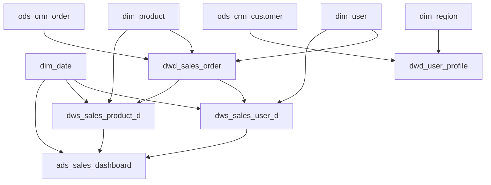

# 生成 ETL 字段映射 (ETL Mapping Generator)

## 触发词

`ETL Mapping`, `字段映射`, `mapping 表`, `ETL 转换规则`, `ETL 设计`, `mapping document`, `字段对照表`, `source-to-target mapping`

---

## 模板绑定

---

| 精简模板 | 路径 | 说明 |
|----------|------|------|
| 09-etl-mapping.yaml | `templates/09-etl-mapping.yaml` | 参考/规范 |

## 输入输出映射

### 必需输入

| 字段 | 类型 | 说明 |
|------|------|------|
| `ddl_scripts` | dict | 来自 `gen-ddl-scripts` 的所有 DDL（按层分组）|
| `etl_tasks` | list | ETL 任务清单（每条含 source_table, target_table, source_layer, target_layer）|

### 可选输入（来自上游 skill）

| 字段 | 来源 skill | 类型 | 说明 |
|------|-----------|------|------|
| `code_tables` | gen-source-data-dict | dict | 代码表 → 决定枚举字段的转换 |
| `data_quality_metrics` | gen-data-quality-report | dict | 质量评估 → 决定清洗规则强度 |
| `dimension_tables` | 用户/上游 | list | 维表清单（强制优先加载）|

### 输出物

| 字段 | 类型 | 说明 |
|------|------|------|
| `mapping_doc_md` | Markdown | 字段映射主文档 |
| `mapping_xlsx_structure` | dict | MAPPING Excel 结构（可由 openpyxl 渲染）|
| `load_order` | list | 加载顺序（DIM 在前，事实表在后）|
| `dependency_graph` | Mermaid | 任务依赖图 |
| `dirty_data_rules` | Markdown | 脏数据处理规则 |
| `outstanding_items` | list | 待确认项 |

---

## 自动执行步骤

1. **解析 DDL** — 解析 `gen-ddl-scripts` 输出的所有 DDL，提取表/字段元数据
2. **构建任务列表** — 根据 `etl_tasks` 列出每条 ETL 任务
3. **识别维表** — 从 DDL 中识别 `dim_*` 前缀的表，加入优先加载列表
4. **拓扑排序** — 按"维表 → 事实表 → 附属表"拓扑排序，生成 `load_order`
5. **生成字段映射** — 对每条任务生成字段级 mapping（source→target、转换规则）
6. **标注维度键** — 标记 `*_key` 字段为外键约束
7. **生成依赖图** — 用 Mermaid 绘制任务依赖图
8. **汇总脏数据规则** — 整合 `data_quality_metrics` 中的清洗规则
9. **输出待确认项** — 列出未提供的转换规则

---

## 加载顺序策略（强制）

### 优先级规则

```
1️⃣ DIM 公共维表（最高优先级，必须最先加载）
    ↓
2️⃣ ODS 源表镜像（按 source_system 分组）
    ↓
3️⃣ DWD 明细层（依赖 ODS）
    ↓
4️⃣ DWS 汇总层（依赖 DWD + DIM）
    ↓
5️⃣ ADS 应用层（依赖 DWS + DIM）
    ↓
6️⃣ TMP / 其他附属表（最低优先级）
```

### 维表优先原则

- 所有 `dim_*` 表必须排在最前
- 维表之间按依赖关系排序（如 `dim_date` → `dim_region` → `dim_product`）
- 事实表等待所有依赖的维表加载完成后才能加载

### 示例加载顺序

```yaml
load_order:
  # Step 1: 维表（无依赖）
  - dim_date
  - dim_region
  - dim_product
  - dim_user
  - dim_order_status

  # Step 2: ODS 层（源数据镜像）
  - ods_crm_order
  - ods_crm_customer
  - ods_erp_inventory

  # Step 3: DWD 层（依赖 ODS + DIM）
  - dwd_sales_order        # 依赖 ods_crm_order + dim_user + dim_product
  - dwd_user_profile       # 依赖 ods_crm_customer + dim_region

  # Step 4: DWS 层（依赖 DWD + DIM）
  - dws_sales_user_d       # 依赖 dwd_sales_order + dim_user + dim_date
  - dws_sales_product_d    # 依赖 dwd_sales_order + dim_product + dim_date

  # Step 5: ADS 层（依赖 DWS + DIM）
  - ads_sales_dashboard    # 依赖 dws_sales_user_d + dws_sales_product_d

  # Step 6: 临时/附属表
  - tmp_data_quality_check
  - tmp_etl_audit_log
```

---

## 输出模板示例

### Markdown 格式

```markdown
# ETL 字段映射文档 v1.0 — {项目名称}

> 生成依据：gen-ddl-scripts 输出
> 加载策略：维表优先
> 责任人：{ETL 架构师}

---

## 1. 加载顺序（强制）

| 序号 | 表名 | 层级 | 依赖 | 类型 |
|------|------|------|------|------|
| 1 | dim_date | DIM | — | 维表 |
| 2 | dim_region | DIM | — | 维表 |
| 3 | dim_product | DIM | — | 维表 |
| 4 | dim_user | DIM | — | 维表 |
| 5 | ods_crm_order | ODS | — | 源表 |
| 6 | ods_crm_customer | ODS | — | 源表 |
| 7 | dwd_sales_order | DWD | ods_crm_order + dim_user + dim_product | 事实表 |
| 8 | dws_sales_user_d | DWS | dwd_sales_order + dim_user + dim_date | 汇总表 |
| 9 | ads_sales_dashboard | ADS | dws_sales_user_d + dws_sales_product_d | 应用表 |

## 2. 任务依赖图



## 3. 字段映射详情

### 3.1 dwd_sales_order ← ods_crm_order + dim_*

| # | 源表.源字段 | 目标字段 | 转换规则 | 维度键 | 备注 |
|---|-------------|----------|----------|--------|------|
| 1 | ods_crm_order.order_id | order_id | 直接映射 | — | 业务主键 |
| 2 | ods_crm_order.user_id | user_key | JOIN dim_user ON user_id | ✓ | 外键 |
| 3 | ods_crm_order.product_id | product_key | JOIN dim_product ON product_id | ✓ | 外键 |
| 4 | dim_date.date_key | date_key | JOIN dim_date ON order_date | ✓ | 时间键 |
| 5 | ods_crm_order.order_amt | order_amount | `CAST(order_amt AS DECIMAL(18,2))` | — | 度量 |
| 6 | ods_crm_order.discount | discount_amount | `COALESCE(discount, 0)` | — | 默认值处理 |
| 7 | ods_crm_order.order_status | order_status | 直接映射 | — | 枚举 |
| 8 | ods_crm_order.create_time | create_time | `TO_TIMESTAMP(create_time, 'yyyy-MM-dd HH:mm:ss')` | — | 时间标准化 |
| 9 | ods_crm_order.update_time | update_time | 同上 | — | — |
| 10 | — | etl_time | `CURRENT_TIMESTAMP` | — | 系统字段 |
| 11 | — | dt | `'${bizdate}'` | — | 分区字段 |

### 3.2 dws_sales_user_d ← dwd_sales_order + dim_user

| # | 源表.源字段 | 目标字段 | 转换规则 | 维度键 |
|---|-------------|----------|----------|--------|
| 1 | dwd_sales_order.user_key | user_key | GROUP BY | ✓ |
| 2 | dwd_sales_order.date_key | date_key | GROUP BY | ✓ |
| 3 | dwd_sales_order.order_id | order_cnt | `COUNT(DISTINCT order_id)` | — |
| 4 | dwd_sales_order.order_amount | gmv | `SUM(order_amount)` | — |
| 5 | dwd_sales_order.pay_amount | pay_amount | `SUM(pay_amount)` | — |
| 6 | dwd_sales_order.item_count | item_cnt | `SUM(item_count)` | — |
| 7 | dwd_sales_order.create_time | first_order_time | `MIN(create_time)` | — |
| 8 | dwd_sales_order.create_time | last_order_time | `MAX(create_time)` | — |

## 4. 脏数据处理规则

| 规则 | 字段 | 处理方式 | 阈值（来自 gen-data-quality-report）|
|------|------|----------|--------------------------------------|
| NULL 替换 | order_amount | `COALESCE(order_amount, 0)` | NULL 率 > 1% |
| 异常值过滤 | order_amount | `WHERE order_amount BETWEEN 0 AND 999999` | 有效率 < 99% |
| 去重 | order_id | `ROW_NUMBER() OVER (PARTITION BY order_id ORDER BY update_time DESC) = 1` | 重复率 > 0% |
| 时间标准化 | create_time | `TO_TIMESTAMP(create_time, 'yyyy-MM-dd HH:mm:ss')` | 格式不一致 |

## 5. 待确认项

- ⚠️ `order_status` 中 `REFUNDED` 与 `CANCELLED` 的区分需业务方确认
- ⚠️ `discount` 字段是否参与 GMV 计算需业务方确认
- ⚠️ 用户维表 SCD 策略（SCD1/SCD2）需确认
```

### Excel MAPPING 表结构

```markdown
📊 MAPPING_XX_XX.xlsx 结构：

Sheet 1: 字段映射主表
  列：序号 | 源表 | 源字段 | 目标表 | 目标字段 | 转换规则 | 维度键 | 备注 | 状态

Sheet 2: 加载顺序
  列：序号 | 表名 | 层级 | 依赖表 | 类型 | 是否维表

Sheet 3: 任务依赖矩阵
  行：目标任务 | 列：依赖任务 | 值：✓/—

Sheet 4: 脏数据规则
  列：表名 | 字段 | 规则类型 | 处理方式 | 阈值

Sheet 5: 变更日志
  列：日期 | 版本 | 修改人 | 修改内容
```

---

## 字段映射规则

### 5 类转换规则

| 规则类型 | 模板 | 适用场景 |
|----------|------|----------|
| **直接映射** | `src.field` | 字段名不同但含义一致 |
| **类型转换** | `CAST(src.field AS target_type)` | 字段类型不一致 |
| **字段合并** | `CONCAT_WS('-', col_a, col_b)` | 多字段合并 |
| **字段拆分** | `SPLIT(src.field, '-')[0]` | 一字段拆多 |
| **代码转换** | `CASE src.field WHEN 'A' THEN '甲' WHEN 'B' THEN '乙' END` | 代码→中文 |
| **空值处理** | `COALESCE(src.field, default)` | NULL 兜底 |
| **计算公式** | `src.price * src.qty` | 派生指标 |
| **维度键查找** | `JOIN dim_user ON src.user_id` | 自然键→代理键 |

### 维度键识别规则

| 模式 | 判定 |
|------|------|
| 字段名以 `_key` 结尾 | ✓ 维度键 |
| 字段名以 `_id` 结尾 + 表前缀为 `dim_*` | ✓ 维度键（维表主键）|
| 字段名以 `_id` 结尾 + 表前缀为 `dwd_*` / `dws_*` | 业务主键（不是维度键）|
| 显式声明 `is_dimension_key: true` | ✓ 维度键 |

---

## Input Validation — 输入不足处理

### 情况 1: 未提供 DDL 清单
**处理**: 强制要求先调用 `gen-ddl-scripts`

```markdown
⚠️ 缺少 DDL 清单。

请先使用 `gen-ddl-scripts` skill 生成所有层的 DDL，然后将其输出作为本 skill 的输入。
```

### 情况 2: 未提供 source/target layer
**处理**: 标注「需明确层级」

```markdown
⚠️ 任务清单中缺少 source_layer / target_layer。

请明确每条 ETL 任务的：
- source_table / source_layer
- target_table / target_layer
```

### 情况 3: 未提供维表清单
**处理**: 自动从 DDL 中识别 `dim_*` 表

```yaml
# 自动识别逻辑
dimension_tables:
  - 从 DDL 中匹配前缀 dim_ 的所有表
  - 同时支持用户显式声明覆盖
```

### 情况 4: 未提供脏数据规则
**处理**: 输出通用清洗模板

```sql
-- 通用清洗模板
WHERE 1=1
  AND order_id IS NOT NULL                    -- 主键非空
  AND order_amount >= 0                       -- 度量非负
  AND create_time IS NOT NULL                 -- 时间非空
  AND update_time >= create_time              -- 时间逻辑
```

---

## 禁止编造

- ❌ 字段映射关系（src.field → tgt.field）
- ❌ 转换公式（CAST / COALESCE / CASE）
- ❌ 维表关联键（"user_id JOIN dim_user"）
- ❌ 加载顺序（必须基于 DDL 依赖分析）
- ❌ 脏数据阈值（必须来自 gen-data-quality-report）

---

## 关键规范

### 加载顺序 3 原则

1. **维表优先** — 所有 `dim_*` 表必须在事实表之前加载
2. **拓扑有序** — 同层内按"上游→下游"排序
3. **并行优化** — 无依赖的表可并行加载

### 命名规范

```
mapping 文件：MAPPING_{源层}_{目标层}.xlsx
示例：MAPPING_ODS_DWD.xlsx / MAPPING_DWD_DWS.xlsx
```

### 调度层级对应

| 加载批次 | 任务数 | 时段 |
|----------|--------|------|
| 1️⃣ DIM 维表 | N | 00:00-01:00 |
| 2️⃣ ODS 抽取 | M | 01:00-02:00 |
| 3️⃣ DWD 清洗 | K | 02:00-03:00 |
| 4️⃣ DWS 汇总 | K | 03:00-04:00 |
| 5️⃣ ADS 应用 | J | 04:00-05:00 |

---

## 示例对话

```
用户: "生成分公司销售域的 ETL 映射"
助手: "我需要以下信息：

必需：
1. 所有层 DDL（来自 gen-ddl-scripts）
2. ETL 任务清单（source_table → target_table）

可选（推荐提供）：
3. 维表清单（默认从 DDL 自动识别）
4. 脏数据处理规则（来自 gen-data-quality-report）
5. 代码表
"
```

```
用户: "DDL 在 ddl/ 目录，任务：ods_crm_order → dwd_sales_order, dwd → dws, dws → ads"
助手: "正在生成映射文档，加载顺序：dim_date → dim_user → dim_product → ods_crm_order → dwd_sales_order → dws_sales_user_d → ads_sales_dashboard"
```

---

## 关联 Skill

### 上游（依赖）
- **gen-ddl-scripts** — 前置：提供 DDL
- **gen-source-data-dict** — 前置：提供代码表、源表结构
- **gen-data-quality-report** — 前置：提供脏数据规则

### 下游（被依赖）
- **gen-etl-sql** — 后置：基于本映射生成 ETL SQL
- **gen-etl-workflow** — 后置：基于本依赖关系生成 DAG
- **gen-etl-unit-tests** — 后置：基于映射生成测试用例

---


## 日志机制

> 📋 详细规范见 [`LOGGING-CONVENTION.md`](data-pipeline/projects/light-dw-toolkit/LOGGING-CONVENTION.md)

本 skill 执行时遵循统一日志机制 v1.2：

### 日志路径查找

```yaml
1. 读取 project_config.yaml 中的 logging 节:
   - skill_execution_log: 所有 skill 执行的统一入口
   - error_log: 错误日志
2. 若 project_config.yaml 不存在 → 使用默认 ./logs/ 目录
3. 优先级: project_config > 环境变量 DW_PROJECT_CONFIG > 默认
```

### 必须记录的事件

| # | 事件 | 何时 | 字段 |
|---|------|------|------|
| 1 | **START** | skill 启动时 | 时间戳、skill 名、项目名、关键输入参数 |
| 2 | **PROGRESS** | 每完成 10% 进度 | 阶段描述、累计进度 |
| 3 | **END** | skill 主体逻辑完成 | 完成时间、耗时、输出物清单 |
| 4 | **REPORT** | END 之后立即 | 成功/部分/失败、警告数、错误数 |
| 5 | **ERROR** | 任何失败（写入 error.log） | 错误码（E0xx-E9xx）、错误消息、上下文 |

### 任务完成报告

完成后输出：

```markdown
## 任务完成报告 — {skill_name}

| 项目 | 值 |
|------|-----|
| 项目名 | {project.name} |
| Skill | {skill_name} v{version} |
| 启动时间 | {start_time ISO8601} |
| 完成时间 | {end_time ISO8601} |
| 耗时 | {duration_seconds} 秒 |
| 结果 | ✅ 成功 / ⚠️ 部分成功 / ❌ 失败 |
| 警告 | {warning_count} |
| 错误 | {error_count} |
```

### 与其他 skill 的日志协同

- 读取 `project_config.yaml` 的 `logging.skill_execution_log` 作为本 skill 的主日志
- 失败时同时写 `error.log`（与所有 skill 共享）
- ETL 类 skill 还会写 `etl_runtime.log`；质量类写 `quality_check.log`；清洗类写 `cleaning_audit.log`
- 如适用，将执行状态写回 `project_config.yaml` 的 `etl_status.tables`

---


## 验证清单

- [ ] 所有 DDL 已解析
- [ ] 维表优先加载顺序已生成
- [ ] 每条 ETL 任务有 source/target 字段映射
- [ ] 维度键已标记
- [ ] 转换规则已显式声明
- [ ] 脏数据规则已整合
- [ ] 任务依赖图已生成（Mermaid）
- [ ] 待确认项已列出
- [ ] 加载顺序无循环依赖
