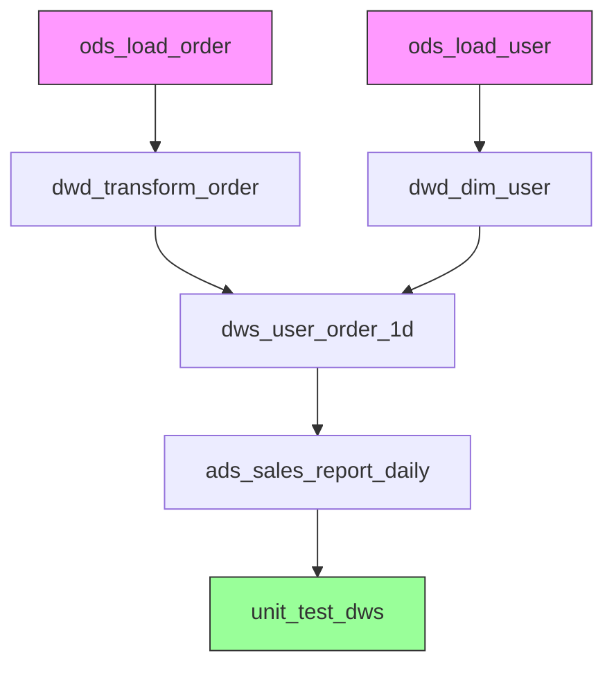

# 生成 ETL 调度工作流 (ETL Workflow / DAG Generator)

## 触发词

`调度 DAG`, `workflow`, `Airflow`, `DolphinScheduler`, `Azkaban`, `任务依赖`, `ETL 调度`, `DAG`, `调度系统`

---

## 模板绑定

---

| 精简模板 | 路径 | 说明 |
|----------|------|------|
| 13-etl-workflow.yaml | `templates/13-etl-workflow.yaml` | 参考/规范 |

## 输入输出映射

### 必需输入

| 字段 | 类型 | 说明 |
|------|------|------|
| `workflow_name` | string | DAG 名称 |
| `schedule_system` | enum | 调度系统：airflow / dolphinscheduler / azkaban / argo |
| `dependency_graph` | object | **来自 `gen-etl-mapping`** 的任务依赖图（必填） |
| `load_order` | list | **来自 `gen-etl-mapping`** 的加载顺序（必填，含 dim_* 维表优先） |

> ⚠️ **关键约束**：本 skill **不重新生成** 任务依赖关系，仅将 `gen-etl-mapping` 的 `load_order` / `dependency_graph` 翻译为调度系统特定语法。

### 可选输入

| 字段 | 类型 | 说明 |
|------|------|------|
| `etl_sql_files` | object | 来自 `gen-etl-sql` 的 SQL 文件路径映射（task → sql_path）|
| `ddl_scripts` | object | 来自 `gen-ddl-scripts` 的 DDL（用于 DDL 任务节点）|
| `tasks` | list | 任务列表（若未提供 load_order 时必填，否则可省略）|
| `cron_expression` | string | 调度周期（默认 `0 2 * * *`）|
| `owner` | string | 责任人 |
| `retry_policy` | dict | 重试策略 |
| `alert_config` | dict | 告警配置 |
| `dimension_priority` | bool | true：维表任务排在最前（默认 true）|

### 输出物

| 字段 | 类型 | 说明 |
|------|------|------|
| `dag_file` | Python/YAML | 调度系统定义文件 |
| `mermaid_diagram` | Mermaid | 工作流可视化图（与 gen-etl-mapping 一致）|
| `task_list` | Markdown 表格 | 任务清单（含加载顺序）|
| `dependency_matrix` | Markdown | 依赖矩阵 |

---

## 输出示例

### Airflow DAG（Python）

```python
"""
{workflow_name} - ETL Workflow
Author: {owner}
Schedule: {cron_expression}
"""
from datetime import datetime, timedelta
from airflow import DAG
from airflow.operators.bash import BashOperator
from airflow.operators.python import PythonOperator
from airflow.utils.trigger_rule import TriggerRule

default_args = {
    'owner': '{owner}',
    'depends_on_past': False,
    'email': ['alert@example.com'],
    'email_on_failure': True,
    'email_on_retry': False,
    'retries': {retry_count or 3},
    'retry_delay': timedelta(minutes=5),
}

with DAG(
    dag_id='{workflow_name}',
    default_args=default_args,
    description='数仓 ETL 调度工作流',
    schedule_interval='{cron_expression}',
    start_date=datetime(2026, 1, 1),
    catchup=False,
    tags=['data-warehouse', 'etl'],
) as dag:

    # ========== ODS 层 ==========
    ods_load_order = BashOperator(
        task_id='ods_load_order',
        bash_command='hive -f scripts/ods_load_order.sql -hivevar bizdate={{ ds }}',
        pool='hive_pool',
    )

    ods_load_user = BashOperator(
        task_id='ods_load_user',
        bash_command='hive -f scripts/ods_load_user.sql -hivevar bizdate={{ ds }}',
        pool='hive_pool',
    )

    # ========== DWD 层 ==========
    dwd_transform_order = BashOperator(
        task_id='dwd_transform_order',
        bash_command='hive -f scripts/dwd_transform_order.sql -hivevar bizdate={{ ds }}',
        pool='hive_pool',
    )

    dwd_dim_user = BashOperator(
        task_id='dwd_dim_user',
        bash_command='hive -f scripts/dwd_dim_user.sql -hivevar bizdate={{ ds }}',
        pool='hive_pool',
    )

    # ========== DWS 层 ==========
    dws_user_order_1d = BashOperator(
        task_id='dws_user_order_1d',
        bash_command='hive -f scripts/dws_user_order_1d.sql -hivevar bizdate={{ ds }}',
        pool='hive_pool',
    )

    # ========== ADS 层 ==========
    ads_sales_report_daily = BashOperator(
        task_id='ads_sales_report_daily',
        bash_command='hive -f scripts/ads_sales_report_daily.sql -hivevar bizdate={{ ds }}',
        pool='hive_pool',
    )

    # ========== 单元测试（依赖 DWS）==========
    unit_test_dws = BashOperator(
        task_id='unit_test_dws',
        bash_command='hive -f tests/unit_test_dws.sql -hivevar bizdate={{ ds }}',
        trigger_rule=TriggerRule.ALL_DONE,
    )

    # ========== 任务依赖关系 ==========
    # ODS 阶段：无依赖（并行）
    # DWD 阶段：依赖 ODS
    dwd_transform_order >> [dws_user_order_1d]
    dwd_dim_user >> [dws_user_order_1d]
    ods_load_order >> dwd_transform_order
    ods_load_user >> dwd_dim_user

    # DWS 阶段：依赖 DWD
    dws_user_order_1d >> [ads_sales_report_daily]

    # ADS 阶段：依赖 DWS
    ads_sales_report_daily >> unit_test_dws
```

### Mermaid 依赖图



### DolphinScheduler 任务定义（YAML）

```yaml
# dolphinscheduler_{workflow_name}.yaml
workflow:
  name: {workflow_name}
  description: 数仓 ETL 调度工作流
  schedule: "{cron_expression}"
  owner: {owner}
  
tasks:
  - name: ods_load_order
    type: HIVE
    sql: scripts/ods_load_order.sql
    parameters:
      bizdate: ${system.biz.date}
    pool: hive_pool
    retry: 3
    retryInterval: 5000
    
  - name: dwd_transform_order
    type: HIVE
    sql: scripts/dwd_transform_order.sql
    parameters:
      bizdate: ${system.biz.date}
    dependencies:
      - ods_load_order
      
  - name: ads_sales_report_daily
    type: HIVE
    sql: scripts/ads_sales_report_daily.sql
    parameters:
      bizdate: ${system.biz.date}
    dependencies:
      - dws_user_order_1d
```

---

## Input Validation — 输入不足处理

### 情况 1: 未指定调度系统
**处理**: 默认生成 Airflow（最流行）

```
⚠️ 未指定调度系统，默认生成 Airflow DAG。
如需 DolphinScheduler / Azkaban / Argo，请告知。
```

### 情况 2: 未提供任务依赖关系
**处理**: 生成空 DAG + 任务列表框架

```python
# 任务定义（请补充依赖关系）
tasks = {
    'task1': BashOperator(...),
    'task2': BashOperator(...),
    # task2.set_downstream(task1)  # 取消注释设置依赖
}
```

### 情况 3: 未提供 CRON
**处理**: 使用默认值 `0 2 * * *`（每日凌晨 2 点）

```python
schedule_interval='0 2 * * *'  # 默认每日凌晨 2 点
```

---

## 调度策略最佳实践

| 策略 | 说明 |
|------|------|
| **依赖倒推** | ADS → DWS → DWD → ODS，逆向推算每个任务的开始时间 |
| **错峰调度** | 大表 ETL 错开时间窗口，避免资源争抢 |
| **失败重试** | 默认 3 次，间隔 5 分钟 |
| **超时告警** | 单任务执行超过 30 分钟触发告警 |
| **SLA 监控** | 关键 ADS 表必须在 8:00 前完成 |
| **数据补数** | 支持回溯补数（backfill）|

---

## 禁止编造

- ❌ 任务名称
- ❌ 上下游依赖关系
- ❌ CRON 表达式
- ❌ 重试策略参数

---

## 关联 Skill

- **gen-etl-sql** - 前置：生成各层 SQL
- **gen-etl-mapping** - 前置：Mapping 决定任务拆分
- **gen-etl-unit-tests** - 后置：在 DAG 末尾添加测试任务

---


## 日志机制

> 📋 详细规范见 [`LOGGING-CONVENTION.md`](data-pipeline/projects/light-dw-toolkit/LOGGING-CONVENTION.md)

本 skill 执行时遵循统一日志机制 v1.2：

### 日志路径查找

```yaml
1. 读取 project_config.yaml 中的 logging 节:
   - skill_execution_log: 所有 skill 执行的统一入口
   - error_log: 错误日志
2. 若 project_config.yaml 不存在 → 使用默认 ./logs/ 目录
3. 优先级: project_config > 环境变量 DW_PROJECT_CONFIG > 默认
```

### 必须记录的事件

| # | 事件 | 何时 | 字段 |
|---|------|------|------|
| 1 | **START** | skill 启动时 | 时间戳、skill 名、项目名、关键输入参数 |
| 2 | **PROGRESS** | 每完成 10% 进度 | 阶段描述、累计进度 |
| 3 | **END** | skill 主体逻辑完成 | 完成时间、耗时、输出物清单 |
| 4 | **REPORT** | END 之后立即 | 成功/部分/失败、警告数、错误数 |
| 5 | **ERROR** | 任何失败（写入 error.log） | 错误码（E0xx-E9xx）、错误消息、上下文 |

### 任务完成报告

完成后输出：

```markdown
## 任务完成报告 — {skill_name}

| 项目 | 值 |
|------|-----|
| 项目名 | {project.name} |
| Skill | {skill_name} v{version} |
| 启动时间 | {start_time ISO8601} |
| 完成时间 | {end_time ISO8601} |
| 耗时 | {duration_seconds} 秒 |
| 结果 | ✅ 成功 / ⚠️ 部分成功 / ❌ 失败 |
| 警告 | {warning_count} |
| 错误 | {error_count} |
```

### 与其他 skill 的日志协同

- 读取 `project_config.yaml` 的 `logging.skill_execution_log` 作为本 skill 的主日志
- 失败时同时写 `error.log`（与所有 skill 共享）
- ETL 类 skill 还会写 `etl_runtime.log`；质量类写 `quality_check.log`；清洗类写 `cleaning_audit.log`
- 如适用，将执行状态写回 `project_config.yaml` 的 `etl_status.tables`

---


## 验证清单

- [ ] DAG 文件语法正确（可加载到调度系统）
- [ ] 任务依赖无循环
- [ ] CRON 表达式合法
- [ ] 关键任务有重试和告警
- [ ] 资源池配置合理
- [ ] Mermaid 图与 DAG 一致
